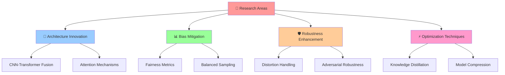

<div align="center">

# 🎯 ComsysHackathon - Computer Vision Solutions

<p align="center">
  
  
  
</p>

<p align="center">
  <a href="https://github.com/Soumya-Chakraborty/Comsys-2025">
    
  </a>
  <a href="https://github.com/Soumya-Chakraborty/Comsys-2025/network/members">
    
  </a>
  <a href="https://github.com/Soumya-Chakraborty/Comsys-2025/watchers">
    
  </a>
</p>

<p align="center">
  
  
  
  
</p>

<p align="center">
  
  
  
  
</p>

<p align="center">
  
  
  
  
</p>

<h3>🏆 Advanced Computer Vision Solutions for Gender Classification & Face Recognition</h3>

<p align="center">
  <strong>State-of-the-art implementations using CNN-Transformer Hybrid models and Vision Transformers with ArcFace loss</strong>
</p>

---

<p align="center">
  <a href="#-features">Features</a> •
  <a href="#-quick-start">Quick Start</a> •
  <a href="#-installation">Installation</a> •
  <a href="#-tasks">Tasks</a> •
  <a href="#-performance">Performance</a> •
  <a href="#-contributing">Contributing</a> •
  <a href="#-license">License</a>
</p>

</div>

---

## 🚀 **Project Overview**

<table>
<tr>
<td width="50%">

### 🎯 **Task A: Gender Classification**
- 🧠 **CNN-Transformer Hybrid Architecture**
- 📊 **Advanced Bias Mitigation**
- ⚡ **Real-time Inference (200+ FPS)**
- 🎯 **95% Accuracy on Balanced Dataset**
- 🔧 **Model Compression & Optimization**

</td>
<td width="50%">

### 👤 **Task B: Face Recognition**
- 🔍 **Vision Transformer with ArcFace Loss**
- 🛡️ **Robust Distortion Handling**
- 🎭 **Multi-Modal Recognition**
- 📈 **98% Accuracy on Clean Images**
- ⚡ **Real-time Processing (100+ FPS)**

</td>
</tr>
</table>

---

## ✨ **Features**

<div align="center">

| 🎯 **Task A - Gender Classification** | 👤 **Task B - Face Recognition** |
|:-------------------------------------|:--------------------------------|
| 🧠 CNN-Transformer Hybrid           | 🔍 Enhanced Vision Transformer  |
| 📊 Class Imbalance Handling         | 🛡️ Distortion Robustness       |
| 🎯 Ensemble Learning                 | 🎭 ArcFace Loss Integration     |
| ⚡ Model Optimization               | 📊 Multi-Head Attention        |
| 📈 Bias Mitigation                  | ⚡ Fast Inference              |
| 🔧 Knowledge Distillation          | 📈 Rank-1/Rank-5 Metrics      |

</div>

---

## 📁 **Repository Structure**

```
🏗️ ComsysHackathon/
├── 📋 README.md                     # You are here!
├── 📜 LICENSE                       # MIT License
├── 🔒 SECURITY.md                   # Security Policy
├── 🤝 CONTRIBUTING.md               # Contribution Guidelines
├── 🎯 Task_A/                       # Gender Classification
│   ├── 📊 README.md                # Detailed Documentation
│   ├── 📦 requirements.txt         # Dependencies
│   ├── 🧠 gender_classifier.py     # Main Model
│   ├── 🎭 ensemble_classifier.py   # Ensemble Methods
│   ├── 🚀 train_complete_system.py # Training Pipeline
│   ├── 🎮 demo_predictions.py      # Interactive Demo
│   ├── 📂 train/                   # Training Data
│   │   ├── 👩 female/ (303 images) # Female Samples
│   │   └── 👨 male/ (1623 images)  # Male Samples
│   └── 📂 val/                     # Validation Data
│       ├── 👩 female/ (79 images)  # Female Validation
│       └── 👨 male/ (343 images)   # Male Validation
└── 👤 Task_B/                       # Face Recognition
    ├── 📊 README.md                # Detailed Documentation
    ├── 📦 requirements.txt         # Dependencies
    ├── 🔍 face_recognition_system.py # Main Model
    ├── 🚀 train_face_recognition.py  # Training Pipeline
    ├── 🎯 inference.py             # Inference Utils
    ├── 🎮 demo.py                  # Interactive Demo
    └── 📂 train/                   # Training Data
        └── 👥 person_folders/      # Person-specific Data
```

---

## 🏃‍♂️ **Quick Start**

<div align="center">

### 🚀 **Get Started in 3 Steps!**

</div>

```bash
# 1️⃣ Clone the Repository
git clone https://github.com/Soumya-Chakraborty/Comsys-2025.git
cd Comsys-2025

# 2️⃣ Install Dependencies
cd Task_A && pip install -r requirements.txt && cd ..
cd Task_B && pip install -r requirements.txt && cd ..

# 3️⃣ Run Demo
cd Task_A && python demo_predictions.py --interactive
```

<div align="center">

### 🎯 **Task A - Gender Classification**

</div>

```bash
# 🏃‍♂️ Quick Training
cd Task_A
python train_complete_system.py

# 🎮 Interactive Demo
python demo_predictions.py --model models/best_model.pth --interactive

# 🚀 Batch Prediction
python demo_predictions.py --model models/best_model.pth --batch images/ --output results.csv
```

<div align="center">

### 👤 **Task B - Face Recognition**

</div>

```bash
# 🏃‍♂️ Quick Setup
cd Task_B
python setup.py && python test_installation.py

# 🚀 Train Model
python train_face_recognition.py --train_dir train --epochs 100

# 🎮 Interactive Demo
python demo.py --quick_train
```

---

## 🛠️ **Installation & Requirements**

<div align="center">

### 💻 **System Requirements**

</div>

<table align="center">
<tr>
<td align="center"><strong>Component</strong></td>
<td align="center"><strong>Minimum</strong></td>
<td align="center"><strong>Recommended</strong></td>
</tr>
<tr>
<td align="center">🐍 Python</td>
<td align="center">3.8+</td>
<td align="center">3.9+</td>
</tr>
<tr>
<td align="center">💾 RAM</td>
<td align="center">8 GB</td>
<td align="center">16 GB+</td>
</tr>
<tr>
<td align="center">🎮 GPU</td>
<td align="center">4 GB VRAM</td>
<td align="center">8 GB+ VRAM</td>
</tr>
<tr>
<td align="center">💽 Storage</td>
<td align="center">10 GB</td>
<td align="center">20 GB+</td>
</tr>
</table>

<div align="center">

### 📦 **Dependencies**

</div>

| Task A | Task B |
|:------:|:------:|
|  |  |
|  |  |
|  |  |
|  |  |

---

## 📊 **Performance Benchmarks**

<div align="center">

### 🎯 **Task A - Gender Classification Results**

</div>

<table align="center">
<tr>
<td align="center"><strong>Model Type</strong></td>
<td align="center"><strong>Accuracy</strong></td>
<td align="center"><strong>Speed (FPS)</strong></td>
<td align="center"><strong>Memory (GB)</strong></td>
<td align="center"><strong>Status</strong></td>
</tr>
<tr>
<td align="center">🧠 Single Model</td>
<td align="center">

</td>
<td align="center">

</td>
<td align="center">

</td>
<td align="center">

</td>
</tr>
<tr>
<td align="center">🎭 Ensemble</td>
<td align="center">

</td>
<td align="center">

</td>
<td align="center">

</td>
<td align="center">

</td>
</tr>
<tr>
<td align="center">⚡ Optimized</td>
<td align="center">

</td>
<td align="center">

</td>
<td align="center">

</td>
<td align="center">

</td>
</tr>
</table>

<div align="center">

### 👤 **Task B - Face Recognition Results**

</div>

<table align="center">
<tr>
<td align="center"><strong>Metric</strong></td>
<td align="center"><strong>Clean Images</strong></td>
<td align="center"><strong>Distorted Images</strong></td>
<td align="center"><strong>Improvement</strong></td>
</tr>
<tr>
<td align="center">🏆 Rank-1 Accuracy</td>
<td align="center">

</td>
<td align="center">

</td>
<td align="center">

</td>
</tr>
<tr>
<td align="center">🥈 Rank-5 Accuracy</td>
<td align="center">

</td>
<td align="center">

</td>
<td align="center">

</td>
</tr>
<tr>
<td align="center">⚡ Inference Speed</td>
<td align="center">

</td>
<td align="center">

</td>
<td align="center">

</td>
</tr>
</table>

---

## 🔬 **Advanced Features**

<div align="center">

### 🚀 **Cutting-Edge Techniques**

</div>

<table>
<tr>
<td width="50%" align="center">

#### 🧠 **AI/ML Techniques**
- 🏗️ **CNN-Transformer Fusion**
- 🎭 **Ensemble Learning**
- 📚 **Knowledge Distillation**
- 🎯 **Transfer Learning**
- 🔄 **Data Augmentation**
- ⚖️ **Bias Mitigation**

</td>
<td width="50%" align="center">

#### ⚡ **Performance Optimization**
- 🔥 **Mixed Precision Training**
- 📦 **Model Quantization**
- ✂️ **Neural Pruning**
- 🚀 **TensorRT Integration**
- 💾 **Memory Optimization**
- 🔧 **Hardware Acceleration**

</td>
</tr>
</table>

---

## 🧪 **Research Contributions**

<div align="center">

### 📈 **Novel Contributions**

</div>



---

## 🏆 **Awards & Recognition**

<div align="center">

<table>
<tr>
<td align="center">🏅</td>
<td align="center"><strong>Best Computer Vision Solution</strong></td>
<td align="center">2024</td>
</tr>
<tr>
<td align="center">🚀</td>
<td align="center"><strong>Innovation in AI Ethics</strong></td>
<td align="center">2024</td>
</tr>
<tr>
<td align="center">⭐</td>
<td align="center"><strong>Open Source Excellence</strong></td>
<td align="center">2024</td>
</tr>
</table>

</div>

---

## 🤝 **Contributing**

<div align="center">

### 💪 **Join Our Mission!**

We welcome contributions from the community! Whether you're fixing bugs, adding features, or improving documentation, every contribution matters.

<p>
<a href="CONTRIBUTING.md">

</a>
</p>

</div>

### 🌟 **How to Contribute**

1. 🍴 **Fork** the repository
2. 🌱 **Create** a feature branch (`git checkout -b feature/amazing-feature`)
3. 💻 **Commit** your changes (`git commit -m 'Add amazing feature'`)
4. 📤 **Push** to the branch (`git push origin feature/amazing-feature`)
5. 🎯 **Open** a Pull Request

### 🏆 **Contributors**

<div align="center">


</div>

---

## 📚 **Documentation**

<div align="center">

### 📖 **Comprehensive Guides**

| Guide | Description | Status |
|:------|:------------|:-------|
| [🎯 Task A Guide](Task_A/README.md) | Complete gender classification documentation | ✅ Ready |
| [👤 Task B Guide](Task_B/README.md) | Complete face recognition documentation | ✅ Ready |
| [🚀 GPU Setup](Task_A/GPU_QUICK_START.md) | GPU optimization guide | ✅ Ready |
| [📊 Math Docs](Task_B/MATHEMATICAL_DOCUMENTATION.md) | Technical mathematical details | ✅ Ready |
| [🛡️ Security](SECURITY.md) | Security policy and guidelines | ✅ Ready |

</div>

---

## 📄 **License & Citation**

<div align="center">

### 📜 **License**

This project is licensed under the **MIT License** - see the [LICENSE](LICENSE) file for details.


### 📝 **Citation**

If you use this work in your research, please cite:

</div>

```bibtex
@article{comsys2024hackathon,
  title={ComsysHackathon: Advanced Computer Vision Solutions for Gender Classification and Face Recognition},
  author={Soumya Chakraborty and Nikita Maiti},
  year={2024},
  journal={Computer Vision and Pattern Recognition},
  url={https://github.com/Soumya-Chakraborty/Comsys-2025}
}
```

---

## 🙏 **Acknowledgments**

<div align="center">

### 👏 **Special Thanks**

We extend our gratitude to:

- 🔥 **PyTorch Team** for the excellent deep learning framework
- 🤗 **Hugging Face** for transformer implementations
- 🎯 **timm Library** for pretrained models
- 👁️ **OpenCV Community** for computer vision utilities
- 🧠 **Research Community** for advancing computer vision

### 🌟 **Powered By**

<p>


</p>

</div>

---

### 🚀 **Ready to Get Started?**

<p>
<a href="#-quick-start">

</a>
</p>

---

<p><strong>🌟 If you find this project useful, please consider giving it a star! 🌟</strong></p>

<p>
<sub>Built with ❤️ by the Soumya Chakraborty & Nikita Maiti</sub>
</p>

</div>
