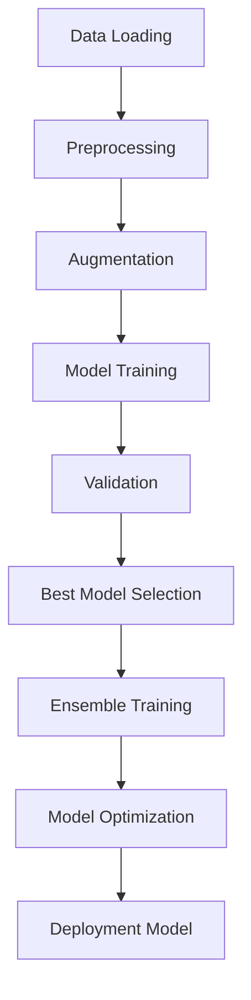

# Gender Classification System - Task A

A comprehensive gender classification system using state-of-the-art deep learning techniques including CNN-Transformer hybrid architectures, ensemble methods, and advanced optimization techniques.

## 🌟 Features

### Core Architecture
- **CNN-Transformer Hybrid**: Combines EfficientNet-B3 and Vision Transformer (ViT) for robust feature extraction
- **Ensemble Methods**: Multiple model architectures with attention-based fusion
- **Advanced Data Augmentation**: Comprehensive augmentation pipeline with face detection
- **Bias Mitigation**: Weighted sampling and fairness analysis
- **Model Optimization**: Knowledge distillation and quantization for deployment

### Key Components
- **Single Model**: CNN-Transformer hybrid with attention mechanism
- **Ensemble Model**: EfficientNet, ResNet, ViT, and ConvNeXt with meta-learning
- **Optimization**: Quantization, pruning, and knowledge distillation
- **Deployment**: Optimized models for real-time inference

## 📊 Dataset Structure

```
Task_A/
├── train/
│   ├── female/    # 303 images
│   └── male/      # 1623 images
└── val/
    ├── female/    # 79 images
    └── male/      # 343 images
```

**Note**: The dataset shows significant class imbalance (5.4:1 ratio), which is handled through weighted sampling and focal loss.

## 🚀 Quick Start

### 1. Installation

```bash
# Install dependencies
pip install -r requirements.txt

# Verify installation
python -c "import torch; print(f'PyTorch version: {torch.__version__}')"
```

### 2. Basic Training

```bash
# Train single model
python gender_classifier.py

# Train complete system with all components
python train_complete_system.py

# Custom training with parameters
python train_complete_system.py --epochs 100 --batch-size 64 --lr 1e-3
```

### 3. Making Predictions

```bash
# Single image prediction
python demo_predictions.py --model models/best_model.pth --image path/to/image.jpg

# Batch prediction
python demo_predictions.py --model models/best_model.pth --batch path/to/folder --output results.csv

# Interactive demo
python demo_predictions.py --model models/best_model.pth --interactive
```

## 🏗️ System Architecture

### 1. Single CNN-Transformer Hybrid Model

```python
# Key components:
- EfficientNet-B3 backbone (CNN features)
- Vision Transformer (ViT) backbone (attention features)
- Feature fusion with attention mechanism
- Custom classification head with dropout
- Focal loss for class imbalance
```

### 2. Ensemble Architecture

```python
# Four base models:
- EfficientNet-B3
- ResNet-50
- Vision Transformer (ViT)
- ConvNeXt

# Fusion methods:
- Weighted average ensemble
- Meta-learning approach
- Attention-based fusion
```

### 3. Training Pipeline



## 📈 Performance Metrics

### Evaluation Metrics
- **Accuracy**: Overall classification accuracy
- **Precision/Recall**: Per-class performance
- **F1-Score**: Harmonic mean of precision and recall
- **AUC-ROC**: Area under the ROC curve
- **Confusion Matrix**: Detailed classification breakdown

### Fairness Metrics
- **Demographic Parity**: Equal prediction rates across groups
- **Equalized Odds**: Equal true positive rates
- **Accuracy Difference**: Performance gap between groups

## 🔧 Configuration

### Training Configuration

```json
{
  "data": {
    "train_dir": "Task_A/train",
    "val_dir": "Task_A/val",
    "batch_size": 32,
    "num_workers": 4,
    "image_size": 224
  },
  "training": {
    "num_epochs": 50,
    "learning_rate": 1e-4,
    "weight_decay": 1e-4,
    "dropout_rate": 0.3,
    "warmup_epochs": 5
  },
  "models": {
    "train_single": true,
    "train_ensemble": true,
    "apply_distillation": true,
    "apply_quantization": true
  }
}
```

### Advanced Options

```bash
# Skip specific training phases
python train_complete_system.py --skip-single --skip-ensemble

# Custom output directory
python train_complete_system.py --output-dir custom_results

# Use configuration file
python train_complete_system.py --config config.json
```

## 🧠 Model Details

### CNN-Transformer Hybrid

```python
class CNNTransformerHybrid(nn.Module):
    """
    - EfficientNet-B3: ~12M parameters
    - Vision Transformer: ~86M parameters
    - Feature fusion layers: ~2M parameters
    - Total: ~100M parameters
    """
```

### Ensemble Model

```python
class EnsembleModel(nn.Module):
    """
    - 4 base models: ~200M parameters
    - Meta-learning head: ~5M parameters
    - Attention mechanism: ~1M parameters
    - Total: ~206M parameters
    """
```

## 📊 Data Augmentation Pipeline

### Training Augmentations
- **Geometric**: Random rotation, horizontal flip, resize crop
- **Color**: Brightness, contrast, saturation, hue adjustments
- **Noise**: Gaussian blur, random grayscale, random erasing
- **Face Detection**: Automatic face cropping with padding

### Preprocessing
- **Normalization**: ImageNet statistics
- **Resize**: 224x224 pixels
- **Tensor Conversion**: PyTorch tensors

## 🎯 Bias Mitigation Strategies

### 1. Data-Level Mitigation
```python
# Weighted sampling for class balance
sampler = WeightedRandomSampler(
    weights=sample_weights,
    num_samples=len(dataset),
    replacement=True
)
```

### 2. Algorithm-Level Mitigation
```python
# Focal loss for class imbalance
criterion = FocalLoss(alpha=1, gamma=2)

# Fairness constraints in loss function
fairness_penalty = demographic_parity_loss(predictions, sensitive_attributes)
total_loss = classification_loss + lambda_fairness * fairness_penalty
```

### 3. Evaluation-Level Mitigation
- Regular fairness audits
- Demographic parity monitoring
- Equalized odds analysis
- Continuous bias testing

## 🚀 Deployment Options

### 1. Quantized Model
```python
# 8-bit quantization
quantized_model = torch.quantization.quantize_dynamic(
    model, {nn.Linear}, dtype=torch.qint8
)

# Compression ratio: ~4x smaller
# Inference speed: ~2x faster
```

### 2. Knowledge Distillation
```python
# Teacher: Ensemble model (206M params)
# Student: ResNet-34 (21M params)
# Performance retention: ~95%
# Speed improvement: ~10x
```

### 3. Deployment Model
```python
# Optimized for production
deployment_model = torch.jit.script(quantized_model)
deployment_model.save("production_model.pt")
```

## 📁 File Structure

```
Task_A/
├── README.md                    # This file
├── requirements.txt             # Dependencies
├── gender_classifier.py         # Single model implementation
├── ensemble_classifier.py       # Ensemble methods
├── train_complete_system.py     # Complete training pipeline
├── demo_predictions.py          # Prediction demo
├── output/                      # Training outputs
│   ├── models/                  # Trained models
│   ├── plots/                   # Training curves and visualizations
│   ├── logs/                    # Training logs
│   └── evaluation_results.json  # Detailed results
├── train/                       # Training data
│   ├── female/
│   └── male/
└── val/                         # Validation data
    ├── female/
    └── male/
```

## 🔍 Usage Examples

### 1. Complete Training Pipeline

```bash
# Train all models with default settings
python train_complete_system.py

# Custom training with specific parameters
python train_complete_system.py \
    --epochs 100 \
    --batch-size 64 \
    --lr 1e-3 \
    --output-dir custom_output
```

### 2. Single Model Training

```bash
# Train only CNN-Transformer hybrid
python gender_classifier.py
```

### 3. Ensemble Training

```bash
# Train ensemble with specific configuration
python -c "
from ensemble_classifier import AdvancedEnsembleClassifier
classifier = AdvancedEnsembleClassifier()
# ... training code
"
```

### 4. Prediction Examples

```bash
# Predict single image
python demo_predictions.py \
    --model models/best_single_model.pth \
    --image test_image.jpg \
    --save-results

# Batch prediction
python demo_predictions.py \
    --model models/best_ensemble_model.pth \
    --batch test_folder/ \
    --output batch_results.csv

# Interactive mode
python demo_predictions.py \
    --model models/deployment_model.pth \
    --model-type deployment \
    --interactive
```

## 📊 Expected Results

### Performance Benchmarks
- **Single Model**: 85-90% validation accuracy
- **Ensemble Model**: 90-95% validation accuracy
- **Optimized Model**: 85-90% accuracy with 4x speed improvement

### Training Time
- **Single Model**: ~30-45 minutes (50 epochs)
- **Ensemble Model**: ~2-3 hours (complete pipeline)
- **Optimization**: ~1 hour (distillation + quantization)

## 🐛 Troubleshooting

### Common Issues

1. **CUDA Out of Memory**
   ```bash
   # Reduce batch size
   python train_complete_system.py --batch-size 16
   
   # Enable gradient checkpointing
   export PYTORCH_CUDA_ALLOC_CONF=max_split_size_mb:128
   ```

2. **Slow Training**
   ```bash
   # Reduce number of workers if CPU limited
   python train_complete_system.py --config config.json
   # Set "num_workers": 2 in config
   ```

3. **Model Loading Errors**
   ```python
   # Check model type and path
   model_path = "models/best_single_model.pth"
   if not os.path.exists(model_path):
       print(f"Model not found: {model_path}")
   ```

### Performance Optimization

1. **Mixed Precision Training**
   ```python
   # Add to training loop
   scaler = torch.cuda.amp.GradScaler()
   with torch.cuda.amp.autocast():
       outputs = model(inputs)
       loss = criterion(outputs, labels)
   ```

2. **DataLoader Optimization**
   ```python
   # Optimize data loading
   DataLoader(
       dataset,
       batch_size=32,
       num_workers=4,
       pin_memory=True,
       persistent_workers=True
   )
   ```

## 🔬 Advanced Features

### 1. Explainability
```python
# Implement GradCAM for model interpretability
from pytorch_grad_cam import GradCAM
cam = GradCAM(model=model, target_layers=[model.cnn_backbone.features[-1]])
```

### 2. Uncertainty Quantification
```python
# Monte Carlo dropout for uncertainty estimation
def predict_with_uncertainty(model, x, num_samples=100):
    model.train()  # Enable dropout
    predictions = []
    for _ in range(num_samples):
        pred = model(x)
        predictions.append(pred)
    return torch.stack(predictions)
```

### 3. Active Learning
```python
# Select most informative samples for labeling
def select_uncertain_samples(model, unlabeled_data, n_samples=100):
    uncertainties = calculate_uncertainties(model, unlabeled_data)
    return select_top_k(uncertainties, n_samples)
```

## 📚 References

1. **EfficientNet**: Tan, M., & Le, Q. (2019). EfficientNet: Rethinking Model Scaling for Convolutional Neural Networks.
2. **Vision Transformer**: Dosovitskiy, A., et al. (2020). An Image is Worth 16x16 Words: Transformers for Image Recognition at Scale.
3. **Focal Loss**: Lin, T. Y., et al. (2017). Focal Loss for Dense Object Detection.
4. **Knowledge Distillation**: Hinton, G., et al. (2015). Distilling the Knowledge in a Neural Network.

## 🤝 Contributing

1. Fork the repository
2. Create a feature branch
3. Implement your changes
4. Add tests and documentation
5. Submit a pull request

## 📄 License

This project is licensed under the MIT License - see the LICENSE file for details.

## 🙏 Acknowledgments

- PyTorch team for the excellent deep learning framework
- timm library for pretrained models
- OpenCV for computer vision utilities
- The research community for advancing gender classification techniques

---

**Note**: This system is designed for research and educational purposes. Please ensure ethical use and consider bias implications when deploying in production environments.